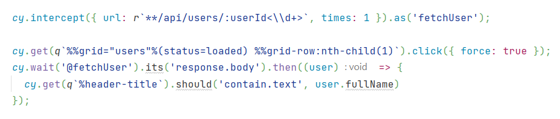

# E2EToolkit



E2EToolkit is a set of tools that aims to make the process for writing e2e-tests 
less tricky and more comfortable, so you can focus on testing scenarios.

> Why and how to use [Test Attributes](docs/TestAttributes.md)

Tools:
- [Q Helper](docs/QHelper.md) // Provides shortcuts for css-queries
- [R Helper](docs/RHelper.md) // Provides shortcuts for url-patternss
- [Element Lookup Assistant](https://github.com/dmitrykatalkin/e2e-toolkit-ela) // Helps to figure out element's test-id without digging into the elements' tree.

## Helpers
### Initialization
```ts
import { e2eHelpersFactory } from 'e2e-toolkit';
export const { q, r } = e2eHelpersFactory(/* Config */);
```
or
```ts
import { e2eHelpersFactory } from 'e2e-toolkit';
const { q, r } = e2eHelpersFactory(/* Config */);

global.q = q;
global.r = r;
```

### Configuration
#### Default config
```ts
interface E2EHelpersConfig {
    customSelectorPrefix: string
    pseudoSelectorPrefix: string
    pseudoSelectorMap: Record<string, string>
}

const config: E2EHelpersConfig = {
    customSelectorPrefix: '%',
    pseudoSelectorPrefix: '%%',
    pseudoSelectorMap: {},
}
```

## Related resources
- [Cypress](https://github.com/cypress-io/cypress) // a next generation front end testing tool built for the modern web
